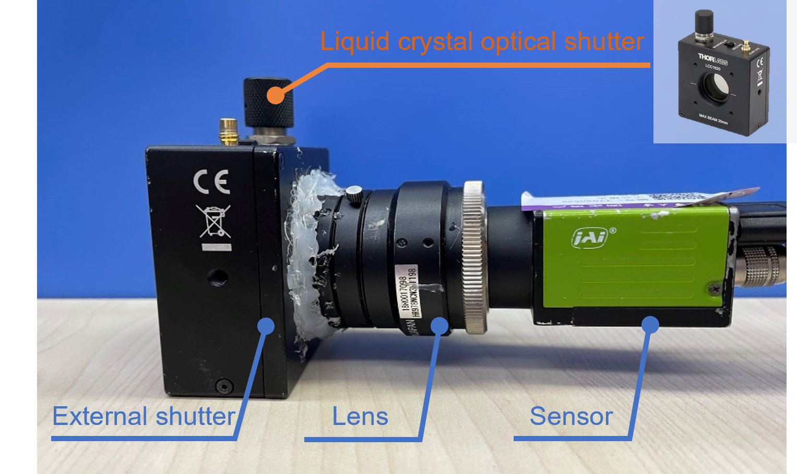
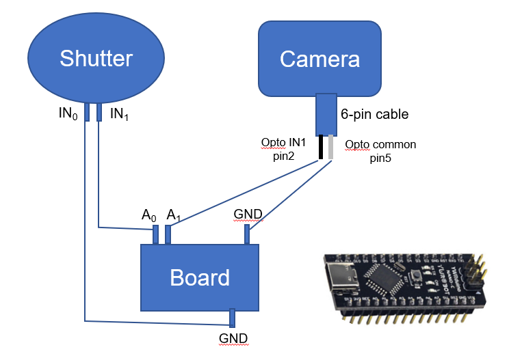
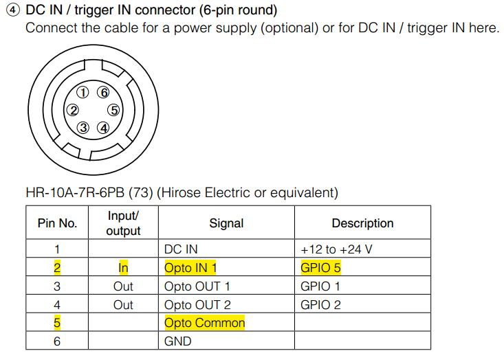
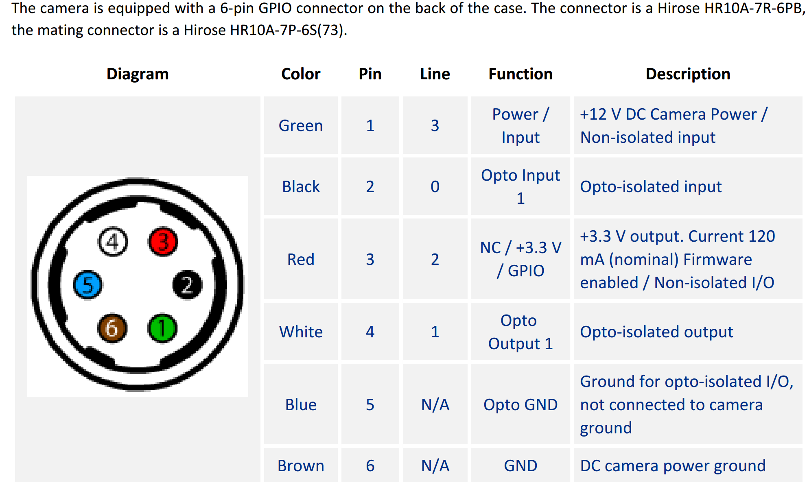
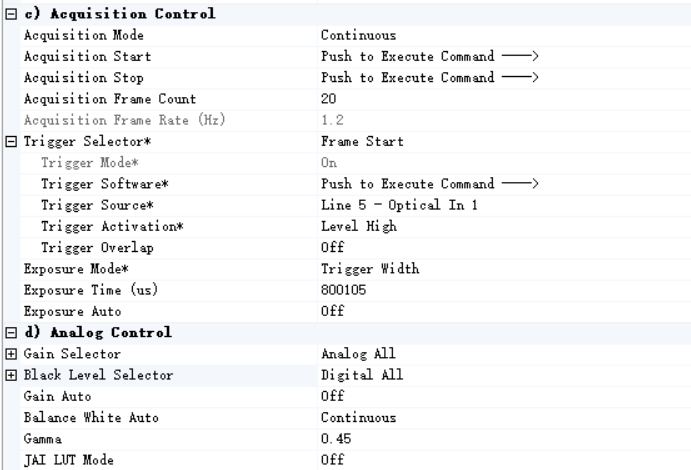

# Coded exposure system control

> Synchronization between an external shutter and a camera with an Arduino board


## Hardware Implementation


### Prototype system 




### System connection




**Note that different camera may have different Line#-Pin# mapping for the 6pin cable**

| | |
|---|---|
| JAI camera           |  |
| FLIR Blackfly camera |  |


### Component list

- [Thorlabs-Liquid crystal optical shutter - LCC1620A](https://www.thorlabs.com/newgrouppage9.cfm?objectgroup_id=8166)
- camera : JAI-GO-5100C-USB / FLIR Blackfly S BFS-U3-50S5C / HIKROBOT MV-CS016-10UC
- [YwRobot Arduino nano controller board](https://i-item.jd.com/10035386897105.html#crumb-wrap)


## Camera setting

- For JAI
  - JAI software：[JAI Control Tool](https://www.jai.com/support-software/jai-software)

> Note: (1) The settings can be found in the Guru mode (changed from [Beginner] to [Guru] from above the config window). (2) Whether to enable the auto white balance and gamma transformation depends on the specific application. 



- For FLIR
  - FLIR software: [Spinnaker-SpinViewer](https://www.flir.com/support-center/iis/machine-vision/downloads/spinnaker-sdk-download/spinnaker-sdk--download-files/) (The configuration is similar to the JAI camera shown above)

- For HIKROBOT
  -  HIKROBOT software: [MVS](https://www.hikrobotics.com/cn/machinevision/service/download?module=0)


## Arduino Software and Code

### IDE and Driver

- [Arduino IDE](https://www.arduino.cc/en/software)
- [Arduino_driver](./Arduino_driver_CH341SER)

> 1. install the IDE first, then install the driver (it could be installed automatically after installing IDE, check it.).
> 2. open the IDE, and connect to the Arduino board (`Arduino Uno Mini`) through `Select Board`


### Synchronization code

```C
/*
 * Info: Arduino code for synchronizing the camera with the external shutter
 * Last Modified: 2023-10-27 22:07:53
 * Modified By: Zhihong Zhang <z_zhi_hong@163.com>
 */

// Arduino pin definition
const int ledPin  =  LED_BUILTIN; // the number of the LED pin
const int shutter =  A0; // the number of the shutter pin
const int camera =  A1; // the number of the camera pin

// coded exposure config: debug test
const long seq[] = {1,1,1,0}; 
const long seqlen = 4; 
const long exposure_time = 1000;           // exposure time (ms) of camera to capture one image
const long exposure_delay = 1;             // delay time (ms) to make sure the hardware are prepared for next capture 

// coded exposure config: cebd
// const long seq[] = {1, 1, 1, 0, 0, 1, 0, 1}; 
// const long seqlen = 8;
// const long exposure_time = 200;           // exposure time (ms) of the camera to capture one image (200ms/exposure, 25ms/encoding-bit)
// const long exposure_delay = 1;            // delay time (1ms) to make sure the hardware are prepared for next capture

// variable init
int ledState = LOW;                       // ledState used to set the LED
unsigned long previousMillis = 0;         // will store last time LED was updated

// pin init
void setup() {
  // set the digital pin as output:
  pinMode(ledPin, OUTPUT);
  pinMode(shutter, OUTPUT);
  pinMode(camera, OUTPUT);
}

// run
void loop() {
  unsigned long currentMillis = millis();

  if (currentMillis - previousMillis >= exposure_time) {
    digitalWrite(camera, 1);
    
    // save the last time you blinked the LED
    previousMillis = currentMillis;

    for (int i=0;i<seqlen;i++){
      ledState = seq[i];
      // set the LED with the ledState of the variable:
      digitalWrite(ledPin, ledState);
      digitalWrite(shutter, !ledState);
      delay(exposure_time / seqlen);
    }
    digitalWrite(camera, 0);
    delay(exposure_delay);
  }
}

```


